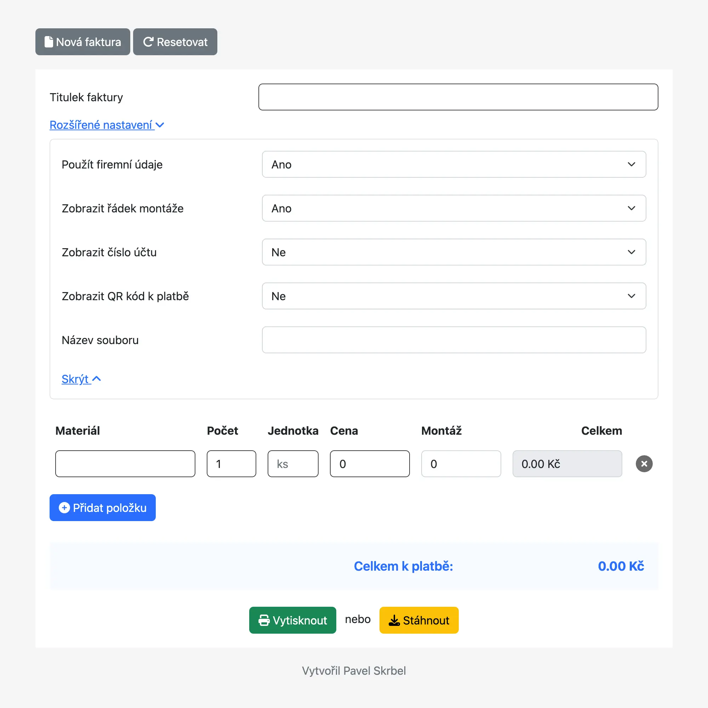
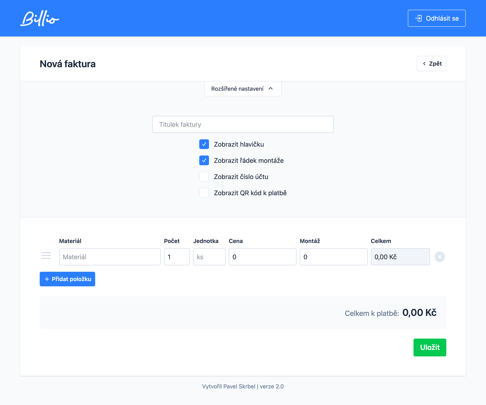

## EleInvoicer

### A simple invoicing app designed specifically for electricians, written in TALL stack.

This application is a rewrite of the old version, which was still used today, but in any case it did not allow moving items or saving individual invoices and editing them.

## Old version

    

## New, current version

    

